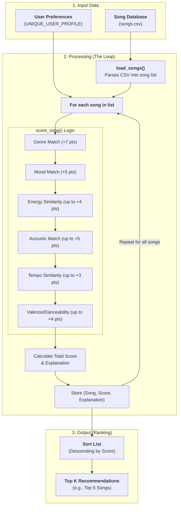

# 🎵 Music Recommender Simulation

## Project Summary

In this project you will build and explain a small music recommender system.

Your goal is to:

- Represent songs and a user "taste profile" as data
- Design a scoring rule that turns that data into recommendations
- Evaluate what your system gets right and wrong
- Reflect on how this mirrors real world AI recommenders

Replace this paragraph with your own summary of what your version does.

---

## How The System Works

Explain your design in plain language.

Some prompts to answer:

- What features does each `Song` use in your system
  - For example: genre, mood, energy, tempo
- What information does your `UserProfile` store
- How does your `Recommender` compute a score for each song
- How do you choose which songs to recommend

You can include a simple diagram or bullet list if helpful.

### Answer:

Real world music recommenders are much more complex. 
- They use collaborative filtering, think "if user A and user B have similar taste, and user A likes song X, then user B might like song X". 
- They also use natural language processing, Spotify crawls the web, reading blogs, news, social media posts to and look for adjectives to form a "word cloud" or vector for every song based on how human talks about it. It helps them understand the "vibe" of a song beyond simple tags. 
- They could also use audio analysis, analyzing the actual audio signal to extract features like tempo, key, energy, danceability, etc. Like what we have from the CSV in this assignment.

For my personal content-based recommender, we'll focus on the characteristics of the items themselves. It's like a chef who knows you love spicy food and garlic, so they'll cook a dish with both.

- The qualities of the songs like -  energy, tempo, valence, danceability, acousticness - will be turned into vector.

Now that we have the songs in vector space, we also need to represent the user's taste profile in the same vector space. 

We measure the distance between the user's taste profile and each song's vector. The closer the distance, the more likely the user will enjoy the song. We will use Euclidean distance and Cosine similarity to calculate the distance.

Every song will get a Similarity Score, then the algorithn will filter out songs user already heard, sort the remaining songs, then return Top - K results.

With all of those in consideration, in reality, user might care a lot about genre, but not so much about tempo. So we will use a weighted average to calculate the final score.

### Data Flow Diagram



### 1. What data are we using?
- **Song Data**: We extract features from `songs.csv`, including categorical data (Genre, Mood) and numerical data (Energy, Tempo, Valence, etc.).
- **User Profile**: We store your "target" values for these features (e.g., your ideal tempo is 120 BPM, your favorite genre is "Lo-fi").

### 2. How are songs scored?
The system uses a **Weighted Point Strategy**. Instead of looking for a single perfect match, it awards points for how well a song aligns with your taste across different "dimensions":

| Feature | Max Points | How it works |
| :--- | :--- | :--- |
| **Genre** | 7.0 | Exact match to your favorite genre. |
| **Mood** | 5.0 | Exact match to your favorite mood. |
| **Energy** | 4.0 | Proximity to your target energy level (0.0 to 1.0). |
| **Acousticness**| 5.0 | Proximity to target + bonus point for boolean preference match. |
| **Tempo** | 3.0 | Similarity to your target BPM (within a 60 BPM range). |
| **Valence/Dance**| 4.0 | Proximity to your target happiness and danceability levels. |

### 3. How do we choose recommendations?
After iterating through the entire catalog and scoring every individual song, the system **sorts** the results from highest to lowest score. It returns the **Top K** (defaulting to 5) songs that most closely align with your profile.

---

## Getting Started

### Setup

1. Create a virtual environment (optional but recommended):

   ```bash
   python -m venv .venv
   source .venv/bin/activate      # Mac or Linux
   .venv\Scripts\activate         # Windows

   ```

2. Install dependencies

```bash
pip install -r requirements.txt
```

3. Run the app:

```bash
python -m src.main
```

### Running Tests

Run the starter tests with:

```bash
pytest
```

You can add more tests in `tests/test_recommender.py`.

---

## Experiments You Tried

Use this section to document the experiments you ran. For example:

- What happened when you changed the weight on genre from 2.0 to 0.5
- What happened when you added tempo or valence to the score
- How did your system behave for different types of users

---

## Limitations and Risks

Summarize some limitations of your recommender.

Examples:

- It only works on a tiny catalog
- It does not understand lyrics or language
- It might over favor one genre or mood

You will go deeper on this in your model card.

---

## Reflection

Read and complete `model_card.md`:

[**Model Card**](model_card.md)

Write 1 to 2 paragraphs here about what you learned:

- about how recommenders turn data into predictions
- about where bias or unfairness could show up in systems like this

---

## 7. `model_card_template.md`

Combines reflection and model card framing from the Module 3 guidance. :contentReference[oaicite:2]{index=2}

```markdown
# 🎧 Model Card - Music Recommender Simulation

## 1. Model Name

Give your recommender a name, for example:

> VibeFinder 1.0

---

## 2. Intended Use

- What is this system trying to do
- Who is it for

Example:

> This model suggests 3 to 5 songs from a small catalog based on a user's preferred genre, mood, and energy level. It is for classroom exploration only, not for real users.

---

## 3. How It Works (Short Explanation)

Describe your scoring logic in plain language.

- What features of each song does it consider
- What information about the user does it use
- How does it turn those into a number

Try to avoid code in this section, treat it like an explanation to a non programmer.

---

## 4. Data

Describe your dataset.

- How many songs are in `data/songs.csv`
- Did you add or remove any songs
- What kinds of genres or moods are represented
- Whose taste does this data mostly reflect

---

## 5. Strengths

Where does your recommender work well

You can think about:

- Situations where the top results "felt right"
- Particular user profiles it served well
- Simplicity or transparency benefits

---

## 6. Limitations and Bias

Where does your recommender struggle

Some prompts:

- Does it ignore some genres or moods
- Does it treat all users as if they have the same taste shape
- Is it biased toward high energy or one genre by default
- How could this be unfair if used in a real product

---

## 7. Evaluation

How did you check your system

Examples:

- You tried multiple user profiles and wrote down whether the results matched your expectations
- You compared your simulation to what a real app like Spotify or YouTube tends to recommend
- You wrote tests for your scoring logic

You do not need a numeric metric, but if you used one, explain what it measures.

---

## 8. Future Work

If you had more time, how would you improve this recommender

Examples:

- Add support for multiple users and "group vibe" recommendations
- Balance diversity of songs instead of always picking the closest match
- Use more features, like tempo ranges or lyric themes

---

## 9. Personal Reflection

A few sentences about what you learned:

- What surprised you about how your system behaved
- How did building this change how you think about real music recommenders
- Where do you think human judgment still matters, even if the model seems "smart"
```
